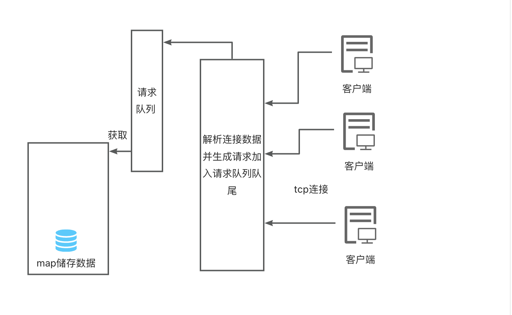

## golang 手搓redis服务器

实现思路:

- 协议: tcp通信
- 数据包: 长度(4byte)+方法(1byte)+数据json
- 数据处理: 单线程map读写
  - 依次处理待处理队列的请求(chan)数据,处理并返回
    - 队列大小: Max指定
    - 构建请求处理池: 不需要反复创建chan

    


    性能压测:
```go
package src

import (
	"fmt"
	"testing"
	"time"
)

func TestClient_Set(t *testing.T) {
	client := NewClient("localhost:8080")
	// fmt.Println("new client")
	go client.HandleResp()
	// fmt.Println("handle resp")
	defer client.Close()
	// fmt.Printf("%v\n", client.Set("name", "zhangsan"))
	// fmt.Println(client.Get("name"))

}

// chan	无缓冲测试
func TestChan(t *testing.T) {
	ch := make(chan int)
	go func() {
		num := <-ch
		fmt.Println(num)
	}()
	ch <- 100
	time.Sleep(time.Second)
}

// 压测my redis
func BenchmarkMyRedisWrite(b *testing.B) {
	c := NewClient("localhost:8080")
	go c.HandleResp()
	defer c.Close()
	//开始计时
	b.StartTimer()
	for i := 0; i < b.N; i++ {
		c.Set("name", "zhangsan")
	}
	// BenchmarkMyRedis-8   	   28090	     40598 ns/op	     642 B/op	      14 allocs/op
}

// 压测my redis
func BenchmarkMyRedisRead(b *testing.B) {
	c := NewClient("localhost:8080")
	go c.HandleResp()
	defer c.Close()
	//开始计时
	b.StartTimer()
	for i := 0; i < b.N; i++ {
		c.Get("name")
	}
	// BenchmarkMyRedisRead-8             27771             44423 ns/op             588
}

// 并发压测(写)
func BenchmarkMyRedisConcurrencyWrite(b *testing.B) {
	c := NewClient("localhost:8080")
	go c.HandleResp()
	defer c.Close()
	//开始计时
	b.StartTimer()
	b.RunParallel(func(pb *testing.PB) {
		for pb.Next() {
			c.Set("name", "zhangsan")
		}
	})
	// BenchmarkMyRedisConcurrencyWrite-8   	   90667	     12439 ns/op	     612 B/op	      14 allocs/op
}

// 并发压测(读)
func BenchmarkMyRedisConcurrencyRead(b *testing.B) {
	c := NewClient("localhost:8080")
	go c.HandleResp()
	defer c.Close()
	//开始计时
	b.StartTimer()
	b.RunParallel(func(pb *testing.PB) {
		for pb.Next() {
			c.Get("name")
		}
	})
	// BenchmarkMyRedisConcurrencyRead-8   	   89955	     12198 ns/op	     512 B/op	      15 allocs/op
}
```

- 单tcp连接可以达到9w左右的读写的QPS